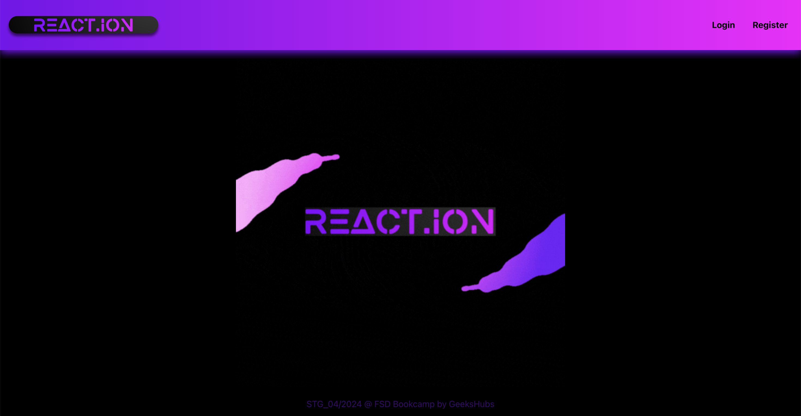
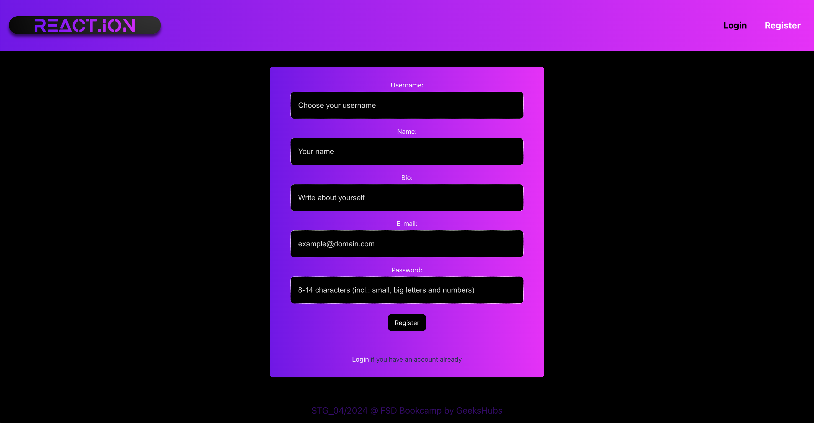
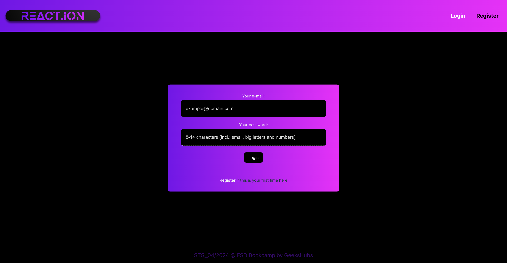
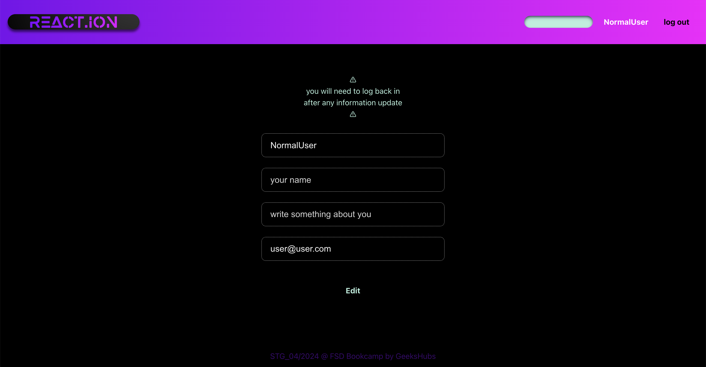
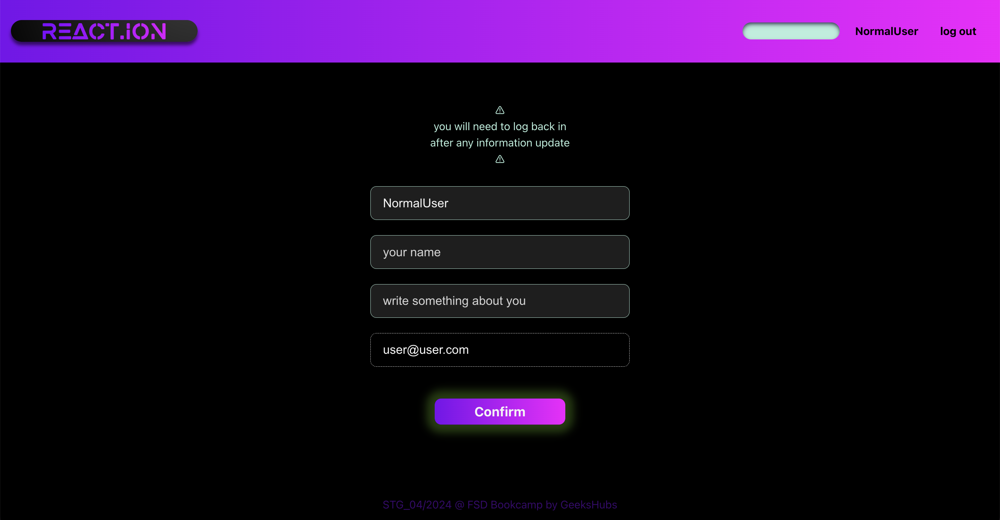
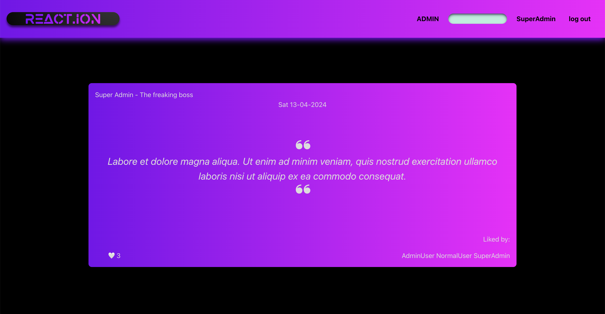
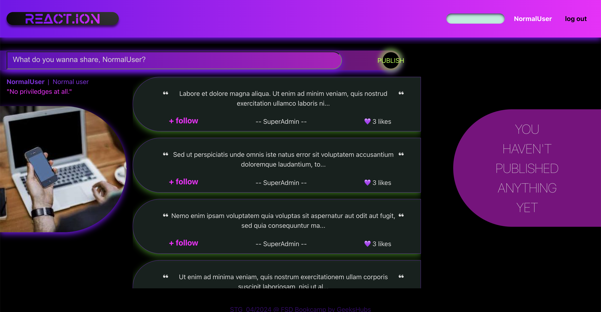
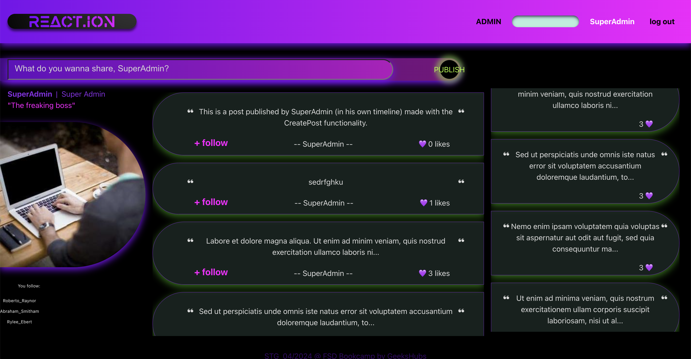

# SOCIAL MEDIA web design

This is the SEVENTH PROJECT of the Full Stack Development Bootcamp with <a href="https://github.com/GeeksHubsAcademy" target="_blank">Geekshubs Academy</a>.
A front-end site based on project number 5 of the bootcamp (<a href="https://github.com/SergioTorresGarcia/Project5-social_media" target="-blank">Social media searching engine</a>).  Made with React.


<br/><br/>
FRONT-END STACK:<br/>
<br/>
BACK-END STACK:<br/>


<details>
  <summary>Table of Contents</summary>
  <ol>
    <li><a href="#project-description-es">Description (ES)</a></li>
    <li><a href="#challenge">Challenge</a></li>
    <li><a href="#instalation-local">Instalation</a></li>
    <!-- <li><a href="#deployment">Deployment</a></li> -->
    <li><a href="#views">Views</a></li>
    <li><a href="#future-improvements">Future improvements / New features</a></li>
    <li><a href="#contributions">Contributions</a></li>
    <li><a href="#bugs">Bugs</a></li>
    <li><a href="#author">Author / Contact </a></li>
  </ol>
</details>

## Project description (ES)
##### Social Media Platform (front-end side)

<details>
  <summary>Read about it (only in spanish)</summary>
  <br/>
<b>Front-end de nuestra red social (proyecto 5 del bootcamp), para poder lanzarla a producción y presentarla al mundo.</b>
<br /><br />

Necesitaremos implementar las vistas que permitan a los usuarios registrarse, hacer login, ver y editar su perfil, crear, ver y actualizar y borrar posts, así como dar y quitar likes a los posts. Sería interesante también poder hacer follow a otros usuarios, y comentar su perfil o sus posts. 
Por supuesto, necesitaremos generar también las vistas necesarias para que los administradores puedan llevar a cabo la gestión de los usuarios y los posts existentes. 

En resumen, tendremos que crear el frontal de una red social lo suficientemente dinámica e intuitiva para que los usuarios puedan navegar por ella.


</details>

## Challenge 🎯
The proposed exercise is to create a front-end site based on the Social Media platform project from a previous exercise. Using React (Vite) and a non-relational database (Mongo DB)

##### Minimum viable product (MVP): 
✅ Landing page (with login & register buttons)

✅ User register

✅ User login

✅ Home page (after login)

- ✅ View that allows user to create a new post
- ✅ View that allows user to see, modify or delete a post
- ✅ View that allows user to see all posts (timeline)

✅ Detail view of a post

✅ Profile view (see info and update)

✅ Functionality to give/remove likes (to posts)

✅ Admin view to manage users (CRUD)

✅ Admin view to manage posts (CRUD)


##### Extras:
✅ Functionality to follow/unfollow other users

☑️ ( partially❗️)Functionality that allows you to search for other users by some field (search bar)

⬜️ View limited to those posts I like, or of contacts of mine

⬜️ Full profile view of my followers

⬜️ Functionality that allows comments (on posts)

☑️ ( partially❗️) Data validation (check all data format before sending it to the back-end...)

☑️ ( partially❗️) Error handling (displaying helpful messages when an error occurs, both form-filling related errors and back-end failed requests/responses)


## Instalation (local)
1.  Clone this repository
2.  Run ` $ npm install ` in terminal
3.  Connect repository with database 
4.  `$ npm run dev`
<br/>

###### ⚠️ Since we will be fetching information from our own API from a previous project, here is how to install the back-end project and how to populate seeders - in case you run out of items to delete :) 

1.  Clone <a href="https://github.com/SergioTorresGarcia/Project5-social_media" target="-blank">this repository</a>
2.  Run ` $ npm install ` in terminal
3.  Connect repository with database 
4.  Run seeders:  ` $ npm run seed `
5.  Start server:  ` $ npm run dev ` 


## Deployment
<div align="center">
    🚀<a href="#author">
        <strong>Deployment pending</strong>
    </a>🚀
</div>


## Views
Landing
<div>

</div><br/>

Register / Login
<div>


</div><br/>

        Login information:
        - as user:
            email: user@user.com
            password: 123456

        - as superadmin:
            email: superadmin@superadmin.com
            password: 123456

        or just create a new user

See profile / Edit profile
<div>


</div><br/>

Post detail
<div>
<br/>
</div><br/>

Home/Main
<div>
<br/>
<br/>
</div><br/>

Admin zone
<div>

</div><br/>


## Future improvements
⬜️ Add a toggle radio button for Login/Register

⬜️ Add picture to profile page

⬜️ Add pictures to posts. Improve visual style of detail card

⬜️ Finish CRUD for Admin (edit users/post)

⬜️ Add delete/edit button also to detail card

⬜️ Implement color modes (add light version and toggle button in header)

⬜️ Finish search function

⬜️ Review and finish visuals in home page (display followers/following)

⬜️ Finish all other proposed extras

⬜️ Deployment (of both front and backend projects)


✅ ( partially❗️) Data validation (check all data format before sending it to the back-end...)

✅ ( partially❗️) Error handling (displaying helpful messages when an error occurs, both form-filling related errors and back-end failed requests/responses)

## Bugs
- Followers list is not displaying in home page
- Profile pictures are harcoded (not uploaded by user)
- Profile editing does not work on fields 'name' and 'bio' (which are not required) - needs to be fixed.
- Several error handling missing
- Almost no validations (due to time constraint)


## Contributions
If you have any comment or suggestion, feel free to reach out to me. My contact is down below.
Or you could as well either:

1. Open an 'issue' here in this project
2. Fork this repository
    - Create a new branch  
        ```
        $ git checkout -b feature/yourUserName-fix
        ```
    - Commit your changes 
        ```
        $ git commit -m 'feat: updating/fixing/improving whatever it is'
        ```
    - Push to the branch
        ```
        $ git push origin feature/yourUserName-fix
        ```
    - Create a Pull Request


## Author
<div align="center">
<a href = "mailto:a.sergiotorres@gmail.com"></a>
<a href="https://github.com/SergioTorresGarcia" target="_blank"></a> 
</div>